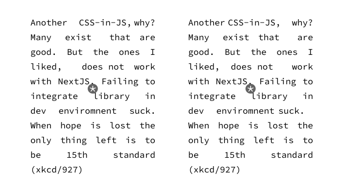

# cssed
🤷‍♂️ CSS-in-JS modules that:
- lets you write CSS in JS, 
- plays nicely with NextJS/create-react-app/Webpack, 
- is blazingly fast zero-runtime by accident
- and zero-configuration by choice

## Rationale
Why create another CSS-in-JS library? Well, I tried hard to avoid doing it, but couldn't find one which does what I want. And I don't want much:

1. Template literals syntax.
2. Write pure CSS/SASS/stylus but in JS.
3. Media queries and pseudoclasses support.
4. Seamless intergration with framework (NextJS in my case). 
5. ⚡️Blazingly fast

More on struggle finding existing solution [here](https://twitter.com/opudalo/status/1296793870697668612)

## Installation
`yarn add cssed` or `npm i cssed`.  

A peer-dependency of [`babel-plugin-macros`](https://github.com/kentcdodds/babel-plugin-macros) is required, so if you don't have it `yarn add babel-plugin-macros`

## Configuration

No configuration required as long as you have enabled `plugin-macros` in your `.babelrc`:

```json
{
  "presets": [
    "next/babel"
  ],
  "plugins": [
    "babel-plugin-macros"
  ]
}
```

Also, to add compilation artifcats to `gitignore`:

```sh
# cssed compilation artifacts 
.*.module.css
```
## Usage

```jsx
import { css } from 'cssed/macro'
import { dark, light } from './constants'

const styles = css`
  .red {
    color: red;
    background: ${dark}
  }

  .blue {
    color: blue;
    background: ${light}
  }
`

const Box = props => <div className={props.isRed ? styles.red : styles.blue}></div>
```

That's it? That's it.

## How it works

Babel macros during compilation will extract content of `css` function call into a separate `.module.css` file and will place it next to a file where `css` function was called.

Before:
```jsx
// index.js – before compilation
import { css } from 'cssed/macro'
const styles = css`.red { color: red; }`

const Box = props => <div className={styles.red}></div>
```

After compilation with `cssed`:
```jsx
// index.js – compiled with cssed macro
import _a from './.index.module.css'
const styles = _a

const Box = props => <div className={styles.red}></div>
```
And file `.index.module.css` contains extracted css:
```css 
/* .index.module.css */ 
/* AUTO GENERATED FILE. DO NOT EDIT  */
.red { color: red; }
```

From here Webpack will handle it as a regular file, which has imported CSS and will process it accordingly to configured pipeline. 

## Syntax Highlight
Same as for `styled-jsx` package.

### [Visual Studio Code Extension](https://marketplace.visualstudio.com/items?itemName=blanu.vscode-styled-jsx)
Launch VS Code Quick Open (⌘+P), paste the following command, and press enter.
```
ext install vscode-styled-jsx
```

### Autocomplete [Visual Studio Code Extension](https://marketplace.visualstudio.com/items?itemName=AndrewRazumovsky.vscode-styled-jsx-languageserver)
Launch VS Code Quick Open (⌘+P), paste the following command, and press enter.
```
ext install vscode-styled-jsx-languageserver
```

## Caveats

Compilation has artifacts in the form of CSS files generated and placed next to source file. They are made hidden to avoid confusion, but it is suboptimal.

What could be improved – place files in `.cssed-cache` folder in root, and import those files from there. But that would mean we need to pre-process `css` and replace paths for any `url()` calls 

## Prior art

This would not be possible, without [linaria](https://github.com/callstack/linaria). In fact inability to make it [work in NextJS](https://github.com/callstack/linaria/issues/667) pushed me over the line to create `cssed` 🙃.  They did awesome job making evaluators for template literals. So you can write expressions like these:
```js
import { light } from './theme'

const cls = css`
.some {
  color: ${light};
  font-size: ${ 22 + 20 }
}
`
```

Other notable projects:
- [stylis.js](https://github.com/thysultan/stylis.js). Pretty much every CSS-in-JS project uses it for compilation. It is ultra fast and realiable, was considering using it, until idea with extracting css into file and letting Webpack do all the hard lifting came to mind.
- [css-zero](https://github.com/CraigCav/css-zero) was a good project to learn from. Also, inspiration for figuring out macros instead of full babel plugins. Craig added `atomic` layer to it, which is nice, but overkill for me. Also, syntax was not what I wanted:
```js
// this will not generate `cls.red` and `cls.blue` you would expect
const cls = css`
  .red { color: red; }   
  .blue { color: blue; }
`
```
- [styled-jsx](https://github.com/vercel/styled-jsx) as with everything guys at Vercel do, it's tailored to awesome devx. Unfortunately, wasn't fit for my needs. This particular issue was super annoying ([codesandbox](https://codesandbox.io/s/mutable-wind-v04po?file=/pages/index.js)):
```jsx
const Header = () => {

  // This will not be styled. It's frustrating as hell.
  const moreItems = <>
    <div className={'item'}></div>
    <div className={'item'}></div>
  </>

  return <>
  <div className={'item'}></div>
  {moreItems}
  <style jsx>{`
  .item {
    color: red;
  }
  `}
  </style>
  </>
}
```
- [astroturf](https://github.com/4Catalyzer/astroturf/). Another awesome project to learn from. They went different direction and rely heavily on PostCSS. `css` api while what I need, didn't work in NextJS and also breaks when trying to use exported value like:
```js
import { dark } from '../theme'

// this will throw
const styles = css`
  .red {
    border: 2px solid ${dark};
    padding: 10px;
  }
`
```
- [csjs](https://github.com/rtsao/csjs) and [csstag](https://github.com/sgtpep/csstag). Two close to what I needed, gave up trying to make them work with NextJS. Also, additional setup required to make it zero-runtime. 👍to both for getting CSS syntax in JS.


## Gimmicks:
CSSed is dead-simple CSS-in-JS implementation, without any gimmicks. Here is one if you need it:**[*](https://en.wikipedia.org/wiki/ASCII_stereogram)**


## License 
MIT
